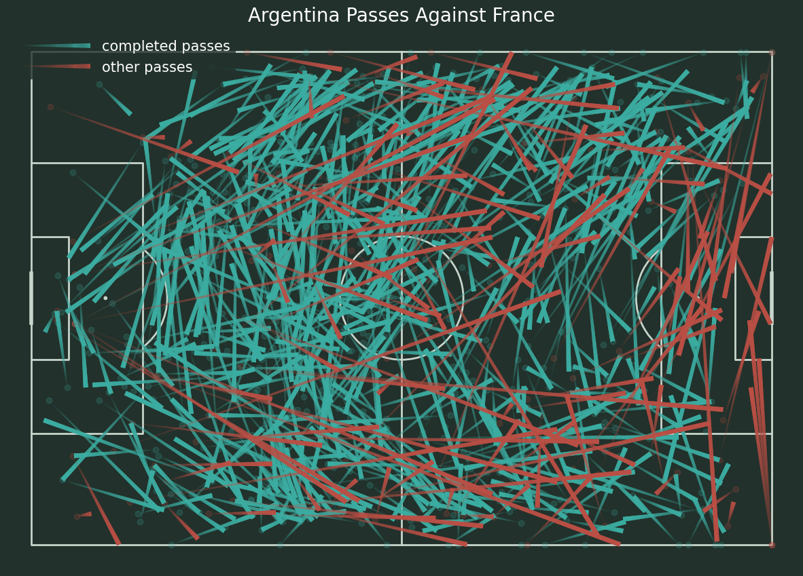
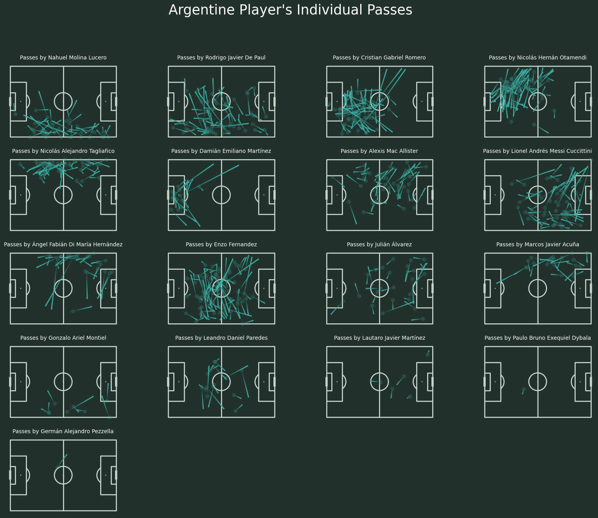
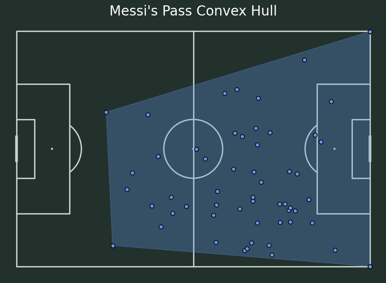
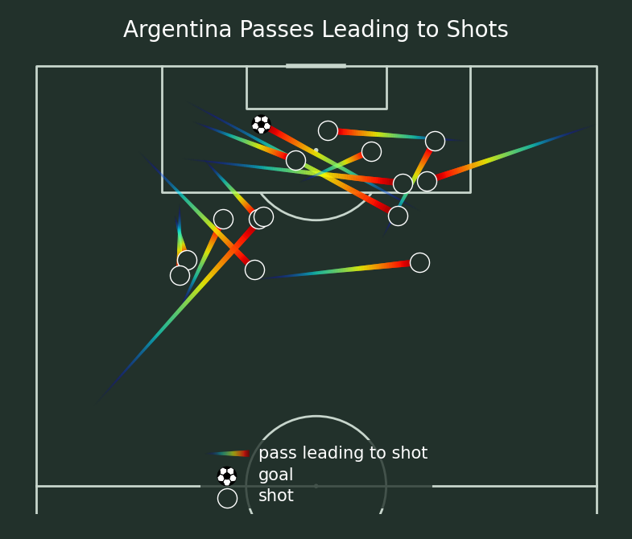
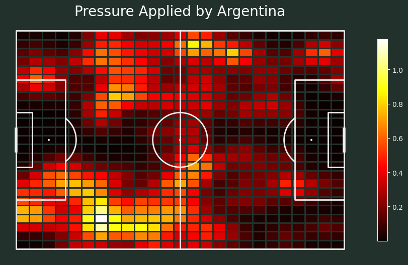

+++
title = 'How to Analyze Football Data Using Python and StatsBomb: FIFA World Cup 2022 Final Example'
description = "A comprehensive guide on performing football data analysis"
slug = "fifa2022-final"
date = "2024-11-24"
image = "cover.jpg"
draft = false
categories = ["My Articles"]
tags= ["data analytics"]
+++

## Introduction

The FIFA World Cup 2022 Final between Argentina and France will be remembered as one of the most thrilling matches in football history. With Argentina clinching victory in a penalty shootout after a 3-3 draw, this match provided a wealth of tactical, individual, and team insights. This analysis working with only Argentina's player passing data to find out key patterns, tactics and insight that shaped this epic encounter.

## Libreries and Data Import

To conduct this analysis, we utilized the StatsBomb API for detailed event data. Key Python libraries included:

- pandas for data manipulation,
- mplsoccer for visualization,
- matplotlib for plotting, and
- scipy for data smoothing.
- The dataset included detailed events such as passes, shots, fouls, and defensive actions from the final matc


```python
# Import Libreries & Packeges
import pandas as pd
import matplotlib.pyplot as plt
from mplsoccer import Pitch, VerticalPitch, FontManager
from matplotlib import rcParams
from statsbombpy import sb
from scipy.ndimage import gaussian_filter
```


```python
# Call Statsbomb API to import data
matches = sb.matches(competition_id=43, season_id=106)
matches[matches['competition_stage']=='Final']
```


<div>
<style scoped>
    .dataframe tbody tr th:only-of-type {
        vertical-align: middle;
    }

    .dataframe tbody tr th {
        vertical-align: top;
    }

    .dataframe thead th {
        text-align: right;
    }
</style>
<table border="1" class="dataframe">
  <thead>
    <tr style="text-align: right;">
      <th></th>
      <th>match_id</th>
      <th>match_date</th>
      <th>kick_off</th>
      <th>competition</th>
      <th>season</th>
      <th>home_team</th>
      <th>away_team</th>
      <th>home_score</th>
      <th>away_score</th>
      <th>match_status</th>
      <th>...</th>
      <th>last_updated_360</th>
      <th>match_week</th>
      <th>competition_stage</th>
      <th>stadium</th>
      <th>referee</th>
      <th>home_managers</th>
      <th>away_managers</th>
      <th>data_version</th>
      <th>shot_fidelity_version</th>
      <th>xy_fidelity_version</th>
    </tr>
  </thead>
  <tbody>
    <tr>
      <th>9</th>
      <td>3869685</td>
      <td>2022-12-18</td>
      <td>17:00:00.000</td>
      <td>International - FIFA World Cup</td>
      <td>2022</td>
      <td>Argentina</td>
      <td>France</td>
      <td>3</td>
      <td>3</td>
      <td>available</td>
      <td>...</td>
      <td>2023-08-17T15:55:15.164685</td>
      <td>7</td>
      <td>Final</td>
      <td>Lusail Stadium</td>
      <td>Szymon Marciniak</td>
      <td>Lionel Sebastián Scaloni</td>
      <td>Didier Deschamps</td>
      <td>1.1.0</td>
      <td>2</td>
      <td>2</td>
    </tr>
  </tbody>
</table>
<p>1 rows × 22 columns</p>
</div>


```python
# Select Fifa Worldcup 2022 "Argentina vs France" final match
events = sb.events(match_id=3869685)

```

## Data Preprocessing

Before diving into analysis, preprocessing steps involved filtering and structuring the data:

- Extracting key events (passes, shot,, goals, player positions),
- Filtering player-specific data (Messi, Argentina),
- Data Normalization


```python
# Check the data
events.tail()
```


<div>
<style scoped>
    .dataframe tbody tr th:only-of-type {
        vertical-align: middle;
    }

    .dataframe tbody tr th {
        vertical-align: top;
    }

    .dataframe thead th {
        text-align: right;
    }
</style>
<table border="1" class="dataframe">
  <thead>
    <tr style="text-align: right;">
      <th></th>
      <th>50_50</th>
      <th>bad_behaviour_card</th>
      <th>ball_receipt_outcome</th>
      <th>ball_recovery_offensive</th>
      <th>ball_recovery_recovery_failure</th>
      <th>block_deflection</th>
      <th>block_offensive</th>
      <th>carry_end_location</th>
      <th>clearance_aerial_won</th>
      <th>clearance_body_part</th>
      <th>...</th>
      <th>substitution_outcome</th>
      <th>substitution_outcome_id</th>
      <th>substitution_replacement</th>
      <th>substitution_replacement_id</th>
      <th>tactics</th>
      <th>team</th>
      <th>team_id</th>
      <th>timestamp</th>
      <th>type</th>
      <th>under_pressure</th>
    </tr>
  </thead>
  <tbody>
    <tr>
      <th>4402</th>
      <td>NaN</td>
      <td>NaN</td>
      <td>NaN</td>
      <td>NaN</td>
      <td>NaN</td>
      <td>NaN</td>
      <td>NaN</td>
      <td>NaN</td>
      <td>NaN</td>
      <td>NaN</td>
      <td>...</td>
      <td>NaN</td>
      <td>NaN</td>
      <td>NaN</td>
      <td>NaN</td>
      <td>NaN</td>
      <td>Argentina</td>
      <td>779</td>
      <td>00:19:07.472</td>
      <td>Half End</td>
      <td>NaN</td>
    </tr>
    <tr>
      <th>4403</th>
      <td>NaN</td>
      <td>NaN</td>
      <td>NaN</td>
      <td>NaN</td>
      <td>NaN</td>
      <td>NaN</td>
      <td>NaN</td>
      <td>NaN</td>
      <td>NaN</td>
      <td>NaN</td>
      <td>...</td>
      <td>NaN</td>
      <td>NaN</td>
      <td>NaN</td>
      <td>NaN</td>
      <td>NaN</td>
      <td>France</td>
      <td>771</td>
      <td>00:05:58.866</td>
      <td>Half End</td>
      <td>NaN</td>
    </tr>
    <tr>
      <th>4404</th>
      <td>NaN</td>
      <td>NaN</td>
      <td>NaN</td>
      <td>NaN</td>
      <td>NaN</td>
      <td>NaN</td>
      <td>NaN</td>
      <td>NaN</td>
      <td>NaN</td>
      <td>NaN</td>
      <td>...</td>
      <td>NaN</td>
      <td>NaN</td>
      <td>NaN</td>
      <td>NaN</td>
      <td>NaN</td>
      <td>Argentina</td>
      <td>779</td>
      <td>00:05:58.866</td>
      <td>Half End</td>
      <td>NaN</td>
    </tr>
    <tr>
      <th>4405</th>
      <td>NaN</td>
      <td>Yellow Card</td>
      <td>NaN</td>
      <td>NaN</td>
      <td>NaN</td>
      <td>NaN</td>
      <td>NaN</td>
      <td>NaN</td>
      <td>NaN</td>
      <td>NaN</td>
      <td>...</td>
      <td>NaN</td>
      <td>NaN</td>
      <td>NaN</td>
      <td>NaN</td>
      <td>NaN</td>
      <td>France</td>
      <td>771</td>
      <td>00:49:35.193</td>
      <td>Bad Behaviour</td>
      <td>NaN</td>
    </tr>
    <tr>
      <th>4406</th>
      <td>NaN</td>
      <td>Yellow Card</td>
      <td>NaN</td>
      <td>NaN</td>
      <td>NaN</td>
      <td>NaN</td>
      <td>NaN</td>
      <td>NaN</td>
      <td>NaN</td>
      <td>NaN</td>
      <td>...</td>
      <td>NaN</td>
      <td>NaN</td>
      <td>NaN</td>
      <td>NaN</td>
      <td>NaN</td>
      <td>Argentina</td>
      <td>779</td>
      <td>00:04:57.514</td>
      <td>Bad Behaviour</td>
      <td>NaN</td>
    </tr>
  </tbody>
</table>
<p>5 rows × 94 columns</p>
</div>


```python
# Check the available colomns
events.columns
```


    Index(['50_50', 'bad_behaviour_card', 'ball_receipt_outcome',
           'ball_recovery_offensive', 'ball_recovery_recovery_failure',
           'block_deflection', 'block_offensive', 'carry_end_location',
           'clearance_aerial_won', 'clearance_body_part', 'clearance_head',
           'clearance_left_foot', 'clearance_other', 'clearance_right_foot',
           'counterpress', 'dribble_nutmeg', 'dribble_outcome', 'dribble_overrun',
           'duel_outcome', 'duel_type', 'duration', 'foul_committed_advantage',
           'foul_committed_card', 'foul_committed_offensive',
           'foul_committed_penalty', 'foul_committed_type', 'foul_won_advantage',
           'foul_won_defensive', 'foul_won_penalty', 'goalkeeper_body_part',
           'goalkeeper_end_location', 'goalkeeper_outcome', 'goalkeeper_position',
           'goalkeeper_technique', 'goalkeeper_type', 'id', 'index',
           'interception_outcome', 'location', 'match_id', 'minute', 'off_camera',
           'out', 'pass_aerial_won', 'pass_angle', 'pass_assisted_shot_id',
           'pass_body_part', 'pass_cross', 'pass_deflected', 'pass_end_location',
           'pass_goal_assist', 'pass_height', 'pass_inswinging', 'pass_length',
           'pass_outcome', 'pass_outswinging', 'pass_recipient',
           'pass_recipient_id', 'pass_shot_assist', 'pass_switch',
           'pass_technique', 'pass_through_ball', 'pass_type', 'period',
           'play_pattern', 'player', 'player_id', 'position', 'possession',
           'possession_team', 'possession_team_id', 'related_events', 'second',
           'shot_aerial_won', 'shot_body_part', 'shot_end_location',
           'shot_first_time', 'shot_freeze_frame', 'shot_key_pass_id',
           'shot_one_on_one', 'shot_outcome', 'shot_statsbomb_xg',
           'shot_technique', 'shot_type', 'substitution_outcome',
           'substitution_outcome_id', 'substitution_replacement',
           'substitution_replacement_id', 'tactics', 'team', 'team_id',
           'timestamp', 'type', 'under_pressure'],
          dtype='object')


```python
# Create x and y lables from "location" data
events[['x','y']]= events['location'].apply(pd.Series)

# Create end_x and end_y Lables from "pass_end_location" Data
events[['end_x','end_y']]= events['pass_end_location'].apply(pd.Series)
```

## Ploting & Visualization

### Aregntina's Pass Analysis
Analysing Argentina's passes and player data will give us key insights into the team's build-up play. Here we will try to understand:
- Completed vs Missed/Other passes
- Player individual passes
- Messi's passes pattern
- Passes leads to goal


```python
# Create new data frame for all the passe's by Aregentine players
ag_pass_df = events[(events['type']=='Pass') & (events['team']=='Argentina')]

# Filter sucessfull passes
mask_pass = ag_pass_df['pass_outcome'].isnull()
```


```python
# Set up the pitch
pitch = Pitch(pitch_type='statsbomb', pitch_color='#22312b', line_color='#c7d5cc')
fig, axs = pitch.draw(figsize=(15, 13), constrained_layout=True, tight_layout=False)
fig.set_facecolor('#22312b')

# Plot the completed passes
pitch.lines(ag_pass_df[mask_pass].x, ag_pass_df[mask_pass].y,
            ag_pass_df[mask_pass].end_x, ag_pass_df[mask_pass].end_y,
            lw=5, transparent=True, comet=True, color='#3cada2', ax=axs, label='completed passes')
pitch.scatter(ag_pass_df[mask_pass].x, ag_pass_df[mask_pass].y, alpha = 0.2, color = "#3cada2", ax=axs)

# Plot the other passes
pitch.lines(ag_pass_df[~mask_pass].x, ag_pass_df[~mask_pass].y,
            ag_pass_df[~mask_pass].end_x, ag_pass_df[~mask_pass].end_y,
            lw=5, transparent=True, comet=True, color='#ba4f45', ax=axs, label='other passes')
pitch.scatter(ag_pass_df[~mask_pass].x, ag_pass_df[~mask_pass].y, alpha = 0.2, color = "#ba4f45", ax=axs)

# Set up the legend
axs.legend(facecolor='#22312b', handlelength=5, edgecolor='None', fontsize=15, loc='upper left', labelcolor='white')

# Set the title
ax_title = axs.set_title('Argentina Passes Against France', fontsize=20, color='white')
```


    

    


```python
# Create player name list
players = ag_pass_df['player'].unique()
```


```python
# Set up the pitch
pitch = Pitch(pitch_type='statsbomb', pitch_color='#22312b', line_color='#c7d5cc')
fig, axs = pitch.draw(nrows=5, ncols=4, figsize=(20,15),constrained_layout=True, tight_layout=False)
fig.set_facecolor('#22312b')

# Convert the axs into one dimension
axs = axs.flatten()

# Plot each player's passes
for i, player in enumerate(players):
    player_passes = ag_pass_df[ag_pass_df['player'] == player]
    
    pitch.lines(player_passes[mask_pass].x, player_passes[mask_pass].y,
             player_passes[mask_pass].end_x, player_passes[mask_pass].end_y,
             lw=2, transparent=True, comet=True, color='#3cada2', ax=axs[i], label='completed passes')
    pitch.scatter(player_passes[mask_pass].x, player_passes[mask_pass].y, alpha = 0.2, color = "#3cada2", ax=axs[i])
    axs[i].set_title(f"Passes by {player}", fontsize=10, color='white')

# Remove extra pitches
for i in range(17,20):
    axs[i].remove()

# Set the title
fig.suptitle("Argentine Player's Individual Passes", fontsize = 25, color='white')
plt.show()
```


    

    


```python
# Filter all the passes from Messi
messi_pass = ag_pass_df[ag_pass_df['player']=='Lionel Andrés Messi Cuccittini']
```


```python
# Set up the pitch
pitch = Pitch(pitch_type='statsbomb', pitch_color='#22312b', line_color='#c7d5cc')
fig, axs = pitch.draw(figsize=(10, 8), constrained_layout=True, tight_layout=False)
fig.set_facecolor('#22312b')

# Plot the pass convex hull
hull = pitch.convexhull(messi_pass.x, messi_pass.y)
poly = pitch.polygon(hull, ax=axs, edgecolor='cornflowerblue', facecolor='cornflowerblue', alpha=0.3)
scatter = pitch.scatter(messi_pass.x, messi_pass.y, ax=axs, edgecolor='black', facecolor='cornflowerblue')

# Set the title
axs_title = axs.set_title("Messi's Pass Convex Hull", fontsize=20, color='white')
```


    

    


```python
shot_pass_df = events.loc[(events['pass_assisted_shot_id'].notnull()) & (events['team']=='Argentina'), ['x', 'y', 'end_x', 'end_y', 'pass_assisted_shot_id']]
shot_df = events.loc[(events['type']=='Shot') & (events['team']=='Argentina'), ['id', 'shot_outcome', 'shot_statsbomb_xg', 'minute']].rename({'id':'pass_assisted_shot_id'}, axis=1)
shot_pass_df = shot_pass_df.merge(shot_df, how='left')
mask_goal = shot_pass_df['shot_outcome'] == 'Goal'
```


```python
# Setup the pitch
pitch = VerticalPitch(pitch_type='statsbomb', pitch_color='#22312b', line_color='#c7d5cc',
                      half=True, pad_top=2)
fig, axs = pitch.grid(endnote_height=0.03, endnote_space=0, figheight=7,
                      title_height=0.08, title_space=0, axis=False,
                      grid_height=0.82)
fig.set_facecolor('#22312b')

# Plot the completed passes
pitch.lines(shot_pass_df.x, shot_pass_df.y, shot_pass_df.end_x, shot_pass_df.end_y,
            lw=6, transparent=True, comet=True, cmap='jet',
            label='pass leading to shot', ax=axs['pitch'])

# Plot the goals
pitch.scatter(shot_pass_df[mask_goal].end_x, shot_pass_df[mask_goal].end_y, s=300,
              marker='football', edgecolors='black', c='white', zorder=2,
              label='goal', ax=axs['pitch'])
pitch.scatter(shot_pass_df[~mask_goal].end_x, shot_pass_df[~mask_goal].end_y,
              edgecolors='white', c='#22312b', s=300, zorder=2,
              label='shot', ax=axs['pitch'])

# Set the title
axs['title'].text(0.5, 0.5, f'Argentina Passes Leading to Shots', color='white',
                  va='center', ha='center', fontsize=20)

# Set legend
legend = axs['pitch'].legend(facecolor='#22312b', edgecolor='None',
                             loc='lower center', handlelength=4)
for text in legend.get_texts():
    text.set_fontsize(15)
    text.set_color('white')

```


    

    


### Argentina's Pressure Analysis
In this section we will try to understand at what positions argentine players dominated the most and at what level


```python
# Filter pressure data
mask_presure = (events['type'] == 'Pressure') & (events['team'] == 'Argentina')
```


```python
# Setup pitch
pitch = Pitch(pitch_type='statsbomb', line_zorder=2,
              pitch_color='#22312b', line_color='#efefef')

# Draw
fig, axs = pitch.draw(figsize=(9, 7))
fig.set_facecolor('#22312b')
bin_statistic = pitch.bin_statistic(events[mask_presure].x, events[mask_presure].y, statistic='count', bins=(25, 25))
bin_statistic['statistic'] = gaussian_filter(bin_statistic['statistic'], 1)
pcm = pitch.heatmap(bin_statistic, ax=axs, cmap='hot', edgecolors='#22312b')

# Add the colorbar and format off-white
cbar = fig.colorbar(pcm, ax=axs, shrink=0.6)
cbar.outline.set_edgecolor('#efefef')
cbar.ax.yaxis.set_tick_params(color='#efefef')
ticks = plt.setp(plt.getp(cbar.ax.axes, 'yticklabels'), color='#efefef')

# Set the title
axs_title = axs.set_title('Pressure Applied by Argentina', fontsize=20, color='white')
```


    

    


## Conclusion
Argentina's performance in the FIFA World Cup 2022 Final showcased their tactical discipline and cohesive play, particularly evident in their passing structure and defensive pressure.

**Passing Insights:**
Argentina's passing network revealed a well-balanced approach, effectively utilizing both central and wide areas. The team prioritized ball retention and progressive play, with Lionel Messi orchestrating attacks through key passes. Their passing patterns created numerical superiority in crucial zones, allowing them to control the game's tempo and exploit spaces in France's defense.

**Defensive Pressure:**
Argentina applied structured defensive pressure, particularly in the first half. Their pressing actions were concentrated in the midfield, aimed at disrupting France’s build-up play and limiting their access to dangerous areas. By maintaining compact defensive lines, Argentina forced turnovers and quickly transitioned into attack, a strategy that kept France under constant pressure.

This combination of controlled passing and well-coordinated pressing was instrumental in Argentina’s dominance for large parts of the match, ultimately contributing to their historic victory.